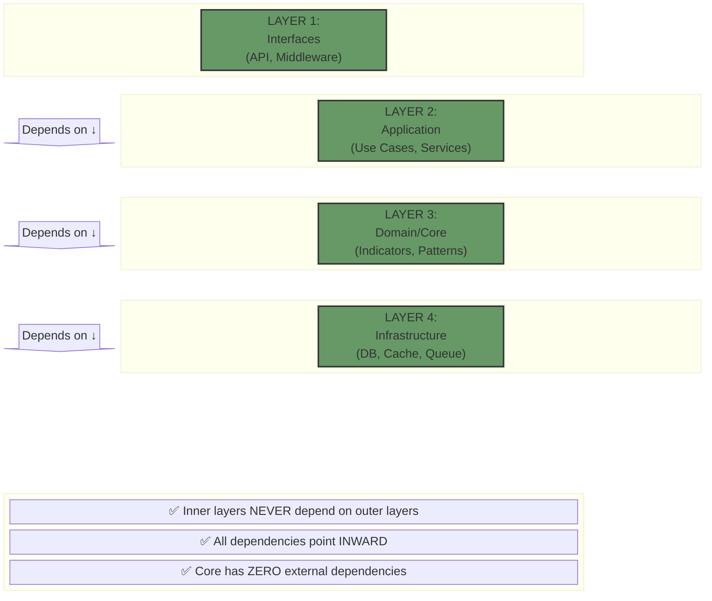

# System Architecture Diagrams

**Project:** Gravity Technical Analysis Microservice  
**Version:** 1.0.0  
**Created:** November 7, 2025  
**Author:** Dr. Chen Wei (Chief Technology Officer)

---

## 1. Clean Architecture Overview

```mermaid
block-beta
  columns 5
  
  block:external:5
    columns 3
    space Client["Client Applications"] space
  end
  
  down1<["HTTP/REST"]>(down)
  
  block:interfaces:5
    columns 5
    space:2 API["API Layer<br/>(FastAPI)"] space:2
  end
  
  down2<[""]>(down)
  
  block:application:5
    columns 5
    UC["Use Cases"] space ML["ML Pipelines"] space Services["Services"]
  end
  
  down3<[""]>(down)
  
  block:core:5
    columns 7
    Indicators["Indicators"] space Patterns["Patterns"] space Analysis["Analysis"] space Entities["Entities"]
  end
  
  down4<[""]>(down)
  
  block:infra:5
    columns 7
    DB["Database"] space Cache["Redis"] space Queue["Kafka"] space Metrics["Monitoring"]
  end
  
  classDef interface fill:#969,stroke:#333,stroke-width:2px
  classDef app fill:#696,stroke:#333,stroke-width:2px
  classDef domain fill:#996,stroke:#333,stroke-width:2px
  classDef infra fill:#669,stroke:#333,stroke-width:2px
  
  class API interface
  class UC,ML,Services app
  class Indicators,Patterns,Analysis,Entities domain
  class DB,Cache,Queue,Metrics infra
```

---

## 2. Request Flow Architecture

```mermaid
block-beta
  columns 7
  
  Client(("Client"))
  
  space
  
  block:middleware:3
    columns 1
    Auth["Authentication"]
    RateLimit["Rate Limiting"]
    Logging["Logging"]
  end
  
  space
  
  API["API<br/>Endpoint"]
  
  down1<[""]>(down)
  
  space
  
  Service["Analysis<br/>Service"]
  
  space
  
  Cache{{"Cache<br/>Check"}}
  
  space
  
  down2<["Hit"]>(right)
  Return1["Return<br/>Cached"]
  
  down3<["Miss"]>(down)
  
  space:3
  
  Indicators["Calculate<br/>Indicators"]
  
  space:3
  
  down4<[""]>(down)
  
  space:3
  
  ML["ML<br/>Analysis"]
  
  space:3
  
  down5<[""]>(down)
  
  space:3
  
  Decision["Generate<br/>Decision"]
  
  space:3
  
  down6<[""]>(down)
  
  space:3
  
  StoreCache["Store in<br/>Cache"]
  
  space:3
  
  down7<[""]>(down)
  
  space:3
  
  Response["Format<br/>Response"]
  
  space:3
  
  Client --> Auth
  Auth --> RateLimit
  RateLimit --> Logging
  Logging --> API
  API --> Service
  Service --> Cache
  Cache --> Indicators
  Indicators --> ML
  ML --> Decision
  Decision --> StoreCache
  StoreCache --> Response
  Response --> Client
  
  style Client fill:#963
  style API fill:#696
  style Cache fill:#996
  style ML fill:#669
```

---

## 3. Layer Dependencies



---

## 4. Indicator Processing Pipeline

```mermaid
block-beta
  columns 11
  
  Input[/"Price Data<br/>(OHLCV)"/]
  
  arrow1<[""]>(right)
  
  block:dimensions:9
    columns 9
    
    Trend["Trend<br/>Analysis<br/>(10 indicators)"]
    space
    Momentum["Momentum<br/>Analysis<br/>(8 indicators)"]
    space
    Volatility["Volatility<br/>Analysis<br/>(8 indicators)"]
    space
    Cycle["Cycle<br/>Analysis<br/>(7 indicators)"]
    space
    SR["S/R<br/>Analysis<br/>(6 methods)"]
  end
  
  down1<[""]>(down)
  
  space:11
  
  block:matrix:11
    columns 5
    space:2 VolumeMatrix["Volume-Dimension Matrix<br/>(5 dimensions × volume)"] space:2
  end
  
  down2<[""]>(down)
  
  space:11
  
  block:decision:11
    columns 5
    space:2 FiveD["5D Decision Matrix<br/>(ML-Powered)"] space:2
  end
  
  down3<[""]>(down)
  
  space:11
  
  Output[\"Signal + Risk + Strategy"/]
  
  style Input fill:#963,stroke:#333
  style Output fill:#396,stroke:#333
  style Trend fill:#696,stroke:#333
  style Momentum fill:#969,stroke:#333
  style Volatility fill:#669,stroke:#333
  style Cycle fill:#996,stroke:#333
  style SR fill:#699,stroke:#333
```

---

## 5. ML Training & Inference Pipeline

```mermaid
block-beta
  columns 7
  
  block:training:3
    columns 1
    Title1["TRAINING PHASE"]
    space
    Historical["Historical<br/>Data"]
    down1<[""]>(down)
    Features["Feature<br/>Extraction"]
    down2<[""]>(down)
    Train["Train ML<br/>Models"]
    down3<[""]>(down)
    Weights["Save<br/>Weights"]
  end
  
  space
  
  arrow<["Weights →"]>(right)
  
  space
  
  block:inference:3
    columns 1
    Title2["INFERENCE PHASE"]
    space
    Live["Live<br/>Data"]
    down4<[""]>(down)
    LoadWeights["Load<br/>Weights"]
    down5<[""]>(down)
    Predict["ML<br/>Prediction"]
    down6<[""]>(down)
    Decision["Trading<br/>Decision"]
  end
  
  style Title1 fill:#963,stroke:#333
  style Title2 fill:#396,stroke:#333
  style Train fill:#696,stroke:#333
  style Predict fill:#669,stroke:#333
```

---

## 6. Caching Strategy

```mermaid
block-beta
  columns 5
  
  Request["API<br/>Request"]
  
  arrow1<[""]>(right)
  
  CacheCheck{{"Check<br/>Cache"}}
  
  arrow2<["Miss"]>(down)
  arrow3<["Hit"]>(right)
  
  ReturnCached["Return<br/>Cached<br/>Result"]
  
  Calculate["Calculate<br/>Indicators<br/>(Expensive)"]
  
  space:3
  
  arrow4<[""]>(down)
  
  space
  
  arrow5<[""]>(down)
  
  space:3
  
  StoreCache["Store in<br/>Cache<br/>(TTL: 60s)"]
  
  space
  
  Response["Format<br/>Response"]
  
  space:3
  
  arrow6<[""]>(down)
  
  space
  
  arrow7<[""]>(down)
  
  space:3
  
  Return["Return to<br/>Client"]
  
  space
  
  End(("End"))
  
  space:3
  
  Request --> CacheCheck
  CacheCheck --> Calculate
  CacheCheck --> ReturnCached
  Calculate --> StoreCache
  StoreCache --> Response
  ReturnCached --> End
  Response --> Return
  Return --> End
  
  style CacheCheck fill:#996
  style StoreCache fill:#669
```

---

## 7. Microservice Communication

```mermaid
block-beta
  columns 9
  
  block:services:9
    columns 9
    
    TechAnalysis["Technical<br/>Analysis<br/>Service"]
    space
    Portfolio["Portfolio<br/>Service"]
    space
    Risk["Risk<br/>Management"]
    space
    Execution["Order<br/>Execution"]
  end
  
  down1<[""]>(down)
  
  space:9
  
  block:messaging:9
    columns 5
    space:2 Kafka["Kafka Message Bus"] space:2
  end
  
  down2<[""]>(down)
  
  space:9
  
  block:discovery:9
    columns 5
    space:2 Consul["Service Discovery<br/>(Consul/Eureka)"] space:2
  end
  
  TechAnalysis --> Kafka
  Portfolio --> Kafka
  Risk --> Kafka
  Execution --> Kafka
  Kafka --> Consul
  
  style Kafka fill:#963,stroke:#333
  style Consul fill:#396,stroke:#333
```

---

## 8. Observability Stack

```mermaid
block-beta
  columns 7
  
  block:app:7
    columns 5
    space:2 Application["Application<br/>(FastAPI)"] space:2
  end
  
  down1<["Metrics"]>(down)
  down2<["Traces"]>(down)
  down3<["Logs"]>(down)
  
  Prometheus["Prometheus"]
  Jaeger["Jaeger"]
  ELK["ELK Stack"]
  
  space
  
  down4<[""]>(down)
  down5<[""]>(down)
  down6<[""]>(down)
  
  space
  
  block:viz:7
    columns 5
    space:2 Grafana["Grafana<br/>Dashboards"] space:2
  end
  
  Application --> Prometheus
  Application --> Jaeger
  Application --> ELK
  Prometheus --> Grafana
  Jaeger --> Grafana
  ELK --> Grafana
  
  style Application fill:#696
  style Prometheus fill:#963
  style Jaeger fill:#369
  style ELK fill:#693
  style Grafana fill:#396
```

---

## 9. Deployment Architecture (Kubernetes)

```mermaid
block-beta
  columns 9
  
  block:ingress:9
    columns 5
    space:2 Ingress["Ingress Controller<br/>(NGINX)"] space:2
  end
  
  down1<[""]>(down)
  
  space:9
  
  block:services:9
    columns 7
    space Service1["Pod 1"] space Service2["Pod 2"] space Service3["Pod 3"] space
  end
  
  down2<[""]>(down)
  
  space:9
  
  block:data:9
    columns 7
    Redis["Redis<br/>Cache"] space Postgres["PostgreSQL<br/>Database"] space Kafka["Kafka<br/>Queue"]
  end
  
  Ingress --> Service1
  Ingress --> Service2
  Ingress --> Service3
  Service1 --> Redis
  Service2 --> Redis
  Service3 --> Redis
  Service1 --> Postgres
  Service2 --> Postgres
  Service3 --> Postgres
  Service1 --> Kafka
  Service2 --> Kafka
  Service3 --> Kafka
  
  style Ingress fill:#963
  style Service1 fill:#696
  style Service2 fill:#696
  style Service3 fill:#696
  style Redis fill:#369
  style Postgres fill:#396
  style Kafka fill:#693
```

---

## 10. Security Layers

```mermaid
block-beta
  columns 5
  
  Client(("Client"))
  
  arrow1<["HTTPS"]>(down)
  
  block:security:5
    columns 1
    WAF["WAF<br/>(Web Application Firewall)"]
    arrow2<[""]>(down)
    RateLimit["Rate Limiting<br/>(100 req/min)"]
    arrow3<[""]>(down)
    JWT["JWT<br/>Authentication"]
    arrow4<[""]>(down)
    RBAC["Role-Based<br/>Access Control"]
    arrow5<[""]>(down)
    InputVal["Input<br/>Validation"]
  end
  
  arrow6<[""]>(down)
  
  API["Secure<br/>API"]
  
  Client --> WAF
  InputVal --> API
  
  style WAF fill:#963
  style JWT fill:#693
  style API fill:#396
```

---

## Diagram Legend

### Colors
- 🟦 **Blue (#696)**: Application/Service Layer
- 🟥 **Red (#963)**: External/Entry Points
- 🟩 **Green (#396)**: Output/Success
- 🟪 **Purple (#996)**: Decision Points
- 🟧 **Orange (#669)**: Infrastructure/Storage

### Arrows
- **→**: Data Flow / Dependency
- **↓**: Hierarchical Relationship
- **Solid**: Synchronous Communication
- **Dashed**: Asynchronous Communication

---

**Document Owner:** Dr. Chen Wei  
**Reviewed By:** Lars Andersson (DevOps), Dmitri Volkov (Backend)  
**Approved By:** Shakour Alishahi (Product Owner)  
**Version:** 1.0  
**Last Updated:** November 7, 2025
